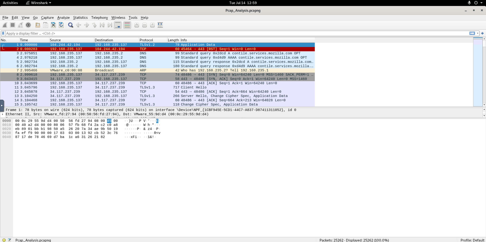
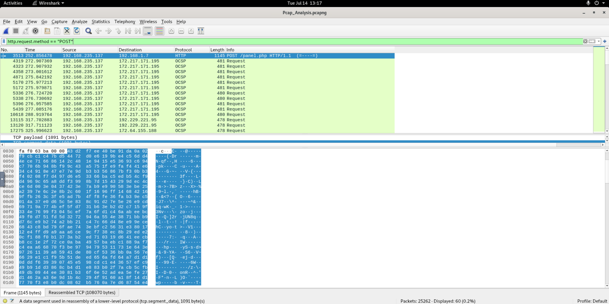
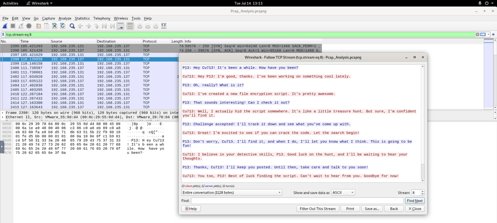
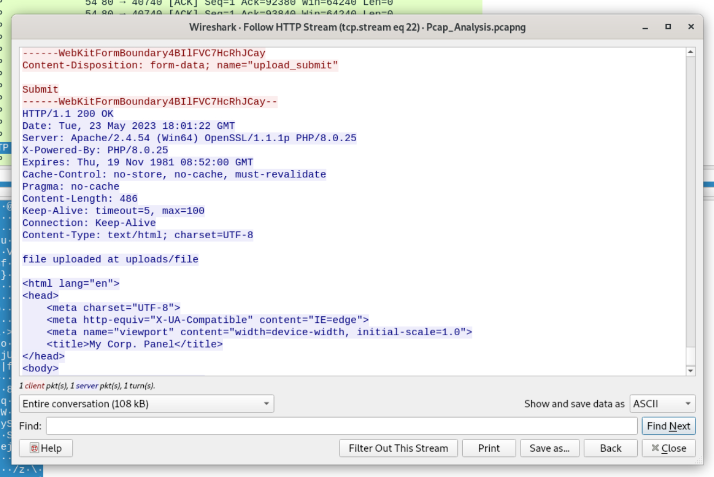
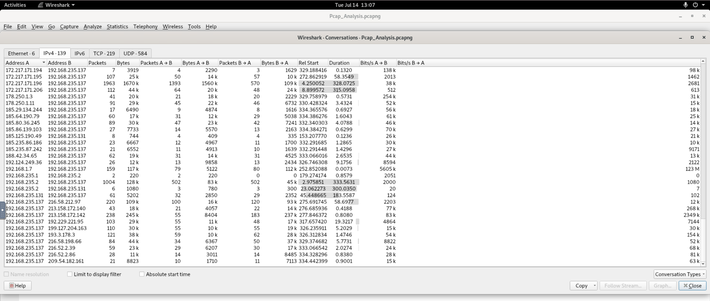

# 🌐 PCAP Analysis — LetsDefend Challenge

| | |
|---|---|
| **Platform** | [LetsDefend](https://app.letsdefend.io/challenge/pcap-analysis) |
| **Category** | Network Forensics |
| **Difficulty** | Easy |
| **Status** | ✅ Solved (6/6) |

---

## 🎯 Scenario

> We have captured this traffic from P13's computer. Can you help him?

- **File location:** `/root/Desktop/ChallengeFile/Pcap_Analysis.pcapng`
- **Total packets:** 25,262

---

## 🧰 Tools used

- **Wireshark** — packet capture analysis
- Display filters, `Statistics > Conversations`, `Follow > TCP/HTTP Stream`

---

## 🔬 Analysis workflow

### 1. Overview
Opening the capture in Wireshark shows ~25k packets. The main internal host
`192.168.235.137` (P13) talks to many external IPs, plus two internal peers
(`192.168.235.131` and `192.168.1.7`).



### 2. Find the file upload (HTTP POST)
Filtering for uploads:

```
http.request.method == "POST"
```

reveals a single relevant request — packet **3513**:

```
192.168.235.137 → 192.168.1.7   POST /panel.php HTTP/1.1
```



### 3. Find the chat (Q1)
Question 1 refers to a **chat**, not the HTTP upload (hint: *"Find the chat. Sender: P13"*).
The answer format `***.***.***.***` also rules out `192.168.1.7` (single-digit octets).

Following the TCP stream between the two internal hosts reveals a plaintext chat:

```
P13:   Hey Cu713! It's been a while...
Cu713: I've created a new file encryption script...
Cu713: Well, I actually hid the script somewhere. It's like a little treasure hunt.
```

- **Sender (P13):** `192.168.235.137`
- **Receiver (Cu713):** `192.168.235.131`



### 4. Inspect the upload (Q3, Q4, Q5)
Following the HTTP stream of packet 3513:

**Request:**
```
POST /panel.php HTTP/1.1
Host: 192.168.1.7
Content-Type: multipart/form-data; ...
Content-Disposition: form-data; name="file"; filename="file"
```
→ the uploaded file is named `file` (binary/encrypted content).

**Response:**
```
HTTP/1.1 200 OK
Server: Apache/2.4.54 (Win64) OpenSSL/1.1.1p PHP/8.0.25
...
file uploaded at uploads/file
```
→ server software `Apache`, saved to directory `uploads`.



### 5. Transfer duration (Q6)
From `Statistics > Conversations` (TCP), the `192.168.1.7 ↔ 192.168.235.137`
conversation shows a **Duration of `0.0073`** seconds — the time to send the
encrypted file (a burst at ~123 Mbit/s).



---

## ❓ Questions & Answers

### 1. In network communication, what are the IP addresses of the sender and receiver?
```
192.168.235.137,192.168.235.131
```
The chat between P13 (sender) and Cu713 (receiver).

### 2. P13 uploaded a file to the web server. What is the IP address of the server?
```
192.168.1.7
```

### 3. What is the name of the file that was sent through the network?
```
file
```

### 4. What is the name of the web server where the file was uploaded?
```
Apache
```

### 5. What directory was the file uploaded to?
```
uploads
```

### 6. How long did it take the sender to send the encrypted file?
```
0.0073
```

---

## 📝 Summary / Lessons learned

- **Read the question carefully.** Q1 was about a *chat*, not the HTTP upload —
  the answer format (3-digit octets) confirmed the correct host pair.
- **`http.request.method == "POST"`** is the fastest way to locate file uploads.
- **Follow HTTP Stream** exposes both the request (`filename=`) and the server's
  response (`Server:` header, storage path).
- **Statistics > Conversations** gives per-flow metadata such as transfer duration.
- The uploaded `file` was encrypted — consistent with the chat where `Cu713`
  mentioned a hidden "file encryption script".

### Indicators / Artifacts

| Type | Value |
|------|-------|
| P13 (sender) | `192.168.235.137` |
| Cu713 (chat peer) | `192.168.235.131` |
| Web server | `192.168.1.7` (Apache/2.4.54, PHP/8.0.25) |
| Upload endpoint | `POST /panel.php` → `uploads/file` |
| Session cookie | `PHPSESSID=a2kttlfv0k65t5g1c0s32lpit8` |
