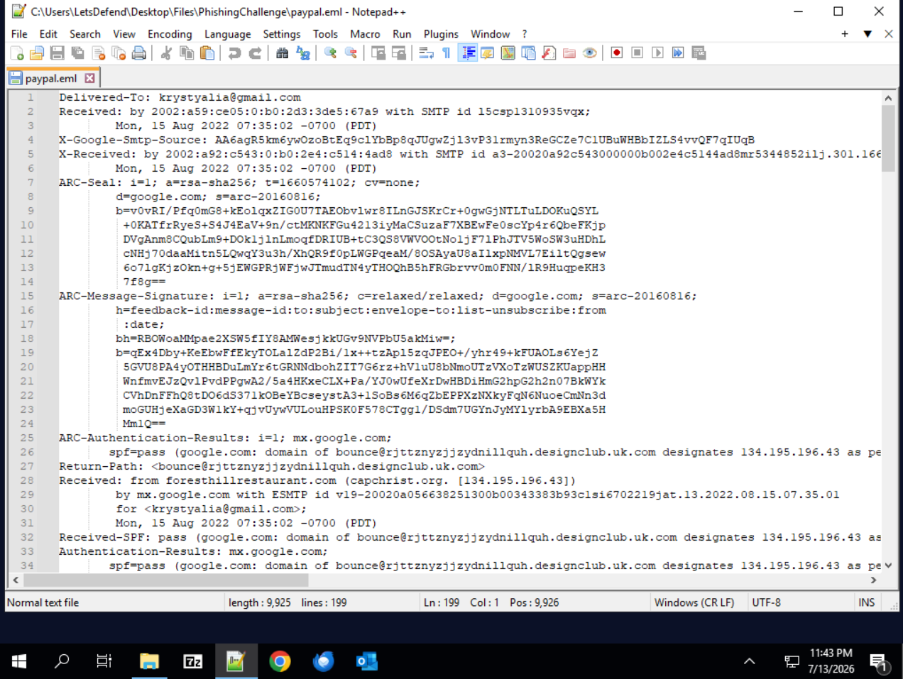
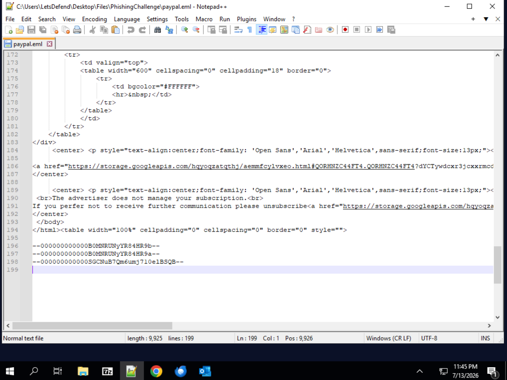
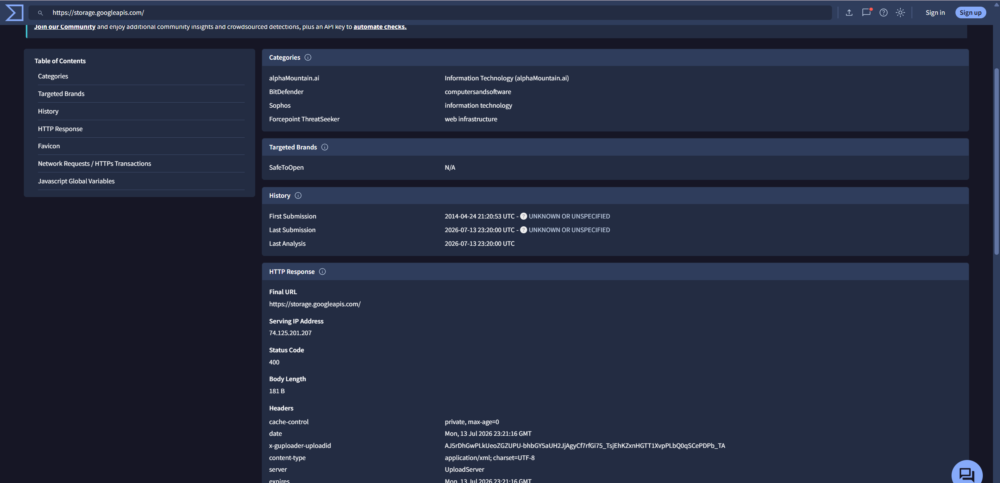

# 📧 Phishing Email — LetsDefend Challenge

| | |
|---|---|
| **Platform** | [LetsDefend](https://app.letsdefend.io/challenge/phishing-email) |
| **Category** | Email Analysis / Phishing |
| **Difficulty** | Easy |
| **Challenge author** | @Fuuji |
| **Status** | ✅ Solved (5/5) |

---

## 🎯 Scenario

> Your email address has been leaked and you receive an email from PayPal in German.
> Try to analyze the suspicious email.

- **File location:** `C:\Users\LetsDefend\Desktop\Files\PhishingChallenge.zip`
- **Password:** `infected`
- **Sample:** `paypal.eml`

---

## 🧰 Tools used

- **Notepad++** — to read the raw `.eml` (headers + body)
- **VirusTotal** — URL / domain reputation and HTTP response metadata
- **curl + sha256sum** — to compute the SHA-256 of the served body
- Manual email header analysis

---

## 🔬 Analysis workflow

### 1. Extract and open the sample
The `PhishingChallenge.zip` archive is password-protected (`infected`) and contains
`paypal.eml`. Opening it in Notepad++ exposes the raw SMTP headers and the MIME body.



### 2. Inspect the headers
Key fields observed:

```
From:  "?P.A.Y.P.A.L?"  <IHKH0MFEWW@kodehexa.net>
Return-Path: <bounce@rjttznyzjjzydnillquh.designclub.uk.com>
Received: from foresthillrestaurant.com (capchrist.org. [134.195.196.43])
To: <[an18]@itlgopk.uk>
Subject:  ?? ?????? ... _______________0759338487
```

- The **From** display name spoofs *PAYPAL* but the real address is `IHKH0MFEWW@kodehexa.net` — nothing to do with PayPal.
- The **Return-Path** points to an unrelated, random-looking domain.
- The **Received** chain references mismatched hosts (`foresthillrestaurant.com`, `capchrist.org`) — a classic sign of a relayed / spoofed message.
- Even though `SPF=pass`, it only validates the *sender's own* malicious infrastructure, not PayPal.

### 3. Inspect the body / URL
The HTML body impersonates a PayPal reward ("PayPal-Guthabenkarte 1000 €") in German
and every call-to-action link points to the same URL:

```
https://storage.googleapis.com/hqyoqzatqthj/aemmfcylvxeo.html#...
```



The attacker hosts the phishing page on **Google Cloud Storage** to look trustworthy
and evade basic URL filtering.

### 4. Compute the Body SHA-256
VirusTotal's current UI no longer exposes the *Body SHA-256* of the phishing URL
(the hosted page was removed, body = 0 B). Following the challenge hint, the **base
domain** must be scanned instead:

```
https://storage.googleapis.com
```

This root returns a **deterministic 181-byte XML error** (HTTP 400,
`MissingSecurityHeader`). Because it is constant, its SHA-256 can be reproduced:

```bash
curl -s "https://storage.googleapis.com/" -o body.txt   # 181 bytes
sha256sum body.txt
# 13945ecc33afee74ac7f72e1d5bb73050894356c4bf63d02a1a53e76830567f5
```



---

## ❓ Questions & Answers

### 1. What is the return path of the email?
```
bounce@rjttznyzjjzydnillquh.designclub.uk.com
```
Read directly from the `Return-Path:` header.

### 2. What is the domain name of the URL in this mail?
```
storage.googleapis.com
```
Extracted from the `<a href=...>` links in the HTML body.

### 3. Is the domain mentioned in the previous question suspicious?
```
Yes
```
Although `storage.googleapis.com` is a legitimate Google service, in this context it
is **abused** to host the phishing page, so it is flagged as suspicious.

### 4. What is the body SHA-256 of the domain?
```
13945ecc33afee74ac7f72e1d5bb73050894356c4bf63d02a1a53e76830567f5
```
SHA-256 of the 181-byte body served by `https://storage.googleapis.com`.

### 5. Is this email a phishing email?
```
Yes
```

---

## 📝 Summary / Lessons learned

- **Never trust the display name.** `"P.A.Y.P.A.L"` was just a label; the real sender
  (`kodehexa.net`) and Return-Path (`designclub.uk.com`) revealed the fraud.
- **SPF=pass ≠ legitimate.** SPF only proves the message came from infrastructure the
  *sender's* domain authorized — a phisher's own domain can pass SPF.
- **Trusted hosting is abused.** Legitimate services like Google Cloud Storage are
  frequently used to host phishing pages and bypass reputation filters.
- **Online artifacts expire.** The phishing page was already removed; investigators
  must sometimes pivot (here, hashing the deterministic base-domain response) to
  recover a stable indicator.

### Indicators of Compromise (IOCs)

| Type | Value |
|------|-------|
| Sender address | `IHKH0MFEWW@kodehexa.net` |
| Return-Path | `bounce@rjttznyzjjzydnillquh.designclub.uk.com` |
| Phishing URL | `https://storage.googleapis.com/hqyoqzatqthj/aemmfcylvxeo.html` |
| Sender IP | `134.195.196.43` |
