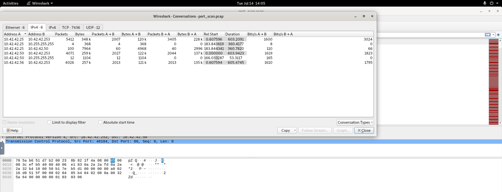
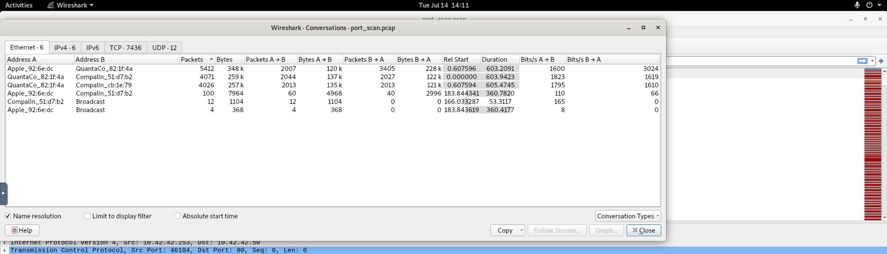
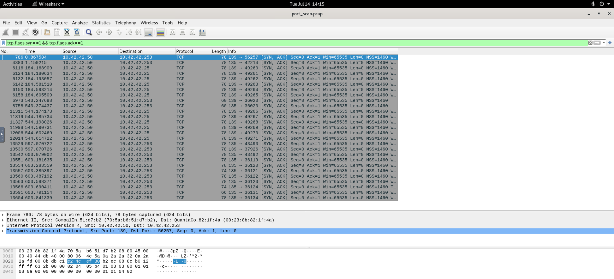

# 🔎 Port Scan Activity — LetsDefend Challenge

| | |
|---|---|
| **Platform** | [LetsDefend](https://app.letsdefend.io/challenge/port-scan-activity) |
| **Category** | Network Forensics |
| **Difficulty** | Easy |
| **Status** | ✅ Solved (4/4) |

---

## 🎯 Scenario

> Can you determine evidences of port scan activity?

- **File location:** `/root/Desktop/ChallengeFile/port_scan.pcap`
- **Total packets:** 13,625

---

## 🧰 Tools used

- **Wireshark** — packet capture analysis
- Display filters, `Statistics > Conversations` (IPv4 + Ethernet with MAC name resolution)

---

## 🔬 Analysis workflow

### 1. Identify the scanner (Q1)
The packet list shows one host, `10.42.42.253`, sending a flood of TCP **SYN**
packets to many ports (80, 554, 389, 256, …) across several destinations
(`.25`, `.50`, `.56`), which mostly reply `RST, ACK` (closed ports).
This burst pattern is the signature of a **port scan**.

`Statistics > Conversations (IPv4)` confirms `10.42.42.253` talks to three hosts
with thousands of packets each → it is the scanner.



### 2. Map hosts to vendors via MAC (Q3)
In `Conversations > Ethernet`, enabling **Name resolution** resolves each MAC to
its vendor. Correlating the packet counts between the IPv4 and Ethernet tabs maps
IP ↔ MAC ↔ vendor:

| IP | MAC | Vendor | Role |
|----|-----|--------|------|
| `10.42.42.253` | `00:23:8b:82:1f:4a` | Quanta | **Scanner** |
| `10.42.42.25`  | `00:16:cb:92:6e:dc` | **Apple** | macOS host |
| `10.42.42.50`  | `70:5a:b6:51:d7:b2` | Compal | Windows host |
| `10.42.42.56`  | `00:26:22:cb:1e:79` | Compal | scanned host |



### 3. Find open ports → identify Windows & found host (Q2, Q4)
Filtering for successful handshakes (open ports):

```
tcp.flags.syn==1 && tcp.flags.ack==1
```

Only `10.42.42.50` replies with `SYN, ACK` — on ports **135 (MSRPC)** and
**139 (NetBIOS)**, both classic **Windows** services. So `10.42.42.50` is the
Windows system, and it is the live host the scan actually discovered.



---

## ❓ Questions & Answers

### 1. What is the IP address scanning the environment?
```
10.42.42.253
```

### 2. What is the IP address found as a result of the scan?
```
10.42.42.50
```
The only host that responded with open ports (135/139).

### 3. What is the MAC address of the Apple system it finds?
```
00:16:cb:92:6e:dc
```

### 4. What is the IP address of the detected Windows system?
```
10.42.42.50
```
Identified by open Windows ports 135 (MSRPC) and 139 (NetBIOS).

---

## 📝 Summary / Lessons learned

- **A port scan is easy to spot in Wireshark:** one source sending many SYN
  packets to many ports/hosts, mostly answered by `RST, ACK`.
- **`Statistics > Conversations`** quickly reveals the top talker (the scanner).
- **MAC vendor resolution** (Ethernet tab) fingerprints device makers — here it
  isolated the Apple host.
- **Open ports = `SYN, ACK` replies.** Filtering `tcp.flags.syn==1 && tcp.flags.ack==1`
  exposes live services; ports 135/139/445 point to Windows.

### Indicators / Artifacts

| Type | Value |
|------|-------|
| Scanner | `10.42.42.253` (Quanta) |
| Apple host | `10.42.42.25` (`00:16:cb:92:6e:dc`) |
| Windows host | `10.42.42.50` (ports 135, 139 open) |
| Other scanned host | `10.42.42.56` |
